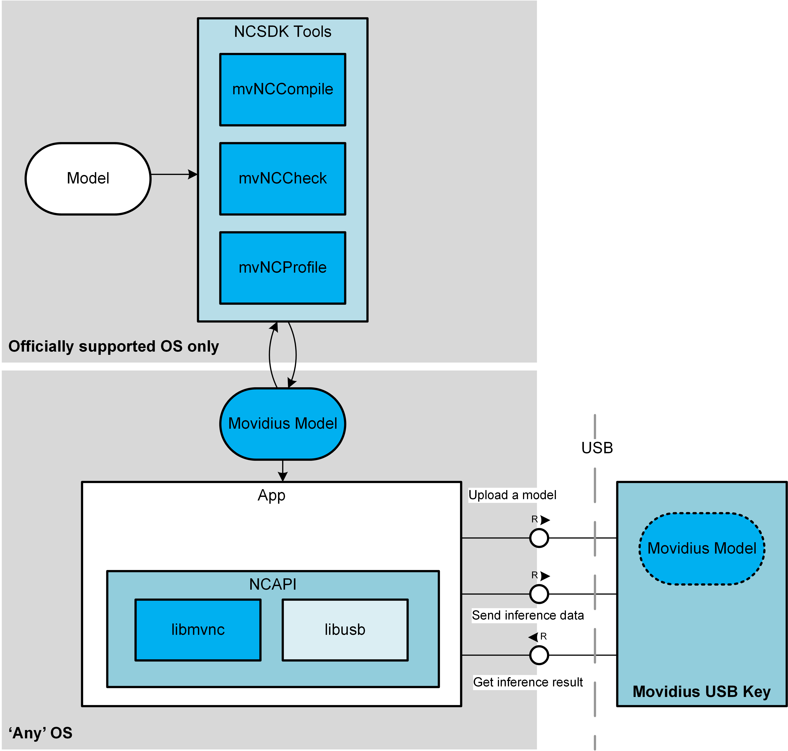

# Movidius on Mac OS

# Tricking the Movidius SDK
There are only few OSes officially **fully** supported by Movidius SDK.
However, Movidius SDK is made of two parts:
* The **NCSDK tools**: these tools allows to translate (and validate the translation) machine learning models to Movidius format so they can be run by the Movidius key. This part is the most complex and not (**not yet**) supported on Mac OS. 
*Note this part does not need a Movidius key to be actually present.*
* **The NCS API**: this part manages communication with Movidius key and allows to upload a model in Movidius format to the Movidius key, upload some inference data and download the inference result. Technically, this part is 'only' a C code using standard libusb to handle a USB conversation so it can run on any OS having libusb and a C compiler.!



## Install prerequisites

1. Let's get a *python* install which will not collide with mac's one
```
brew install python2
pip install --upgrade pip setuptools wheel
brew install python3
pip3 install --upgrade pip setuptools wheel
```
2. libmvnc.so uses libusb.so to send/receive data through usb
```
brew install libusb
```
3. ncsdk makefile (me too by the way) does not like Mac's sed. Let's get a more standard one by installing *gsed*
```
brew install gnu-sed
```
4. ncsdk samples need to download graphs and therefore need to use *wget*
```
brew install wget
```
5. Install *tensorflow* in our python env
```
pip install tensorflow
```
6. We will need opencv
```
brew install opencv
````
7. we will need a C/C++ compiler. Install Xcode (it's free now) and be sure to install and activate command line tools
```
xcode-select --install
```

## Install & Trick Movidius SDK
1. Grab standard *ncsdk*
```
cd $HOME
mkdir Movidius
cd $HOME/Movidius
git clone https://github.com/movidius/ncsdk.git
```
2. Trick the Makefile & generate the only mandatory component on Mac OS: libmvnc.so
```
cd ncsdk
# adapt compilation env to Mac and use gsed instead of sed
find . -name Makefile -exec sed -i -- 's/include\/libusb/local\/include\/libusb/g; s/sed/gsed/g' {} \;
# fix an issue with execution rights
find . -name run.py -exec chmod +x {} \;
cd api/src
make all
sudo make basicinstall pythoninstall
```
Now, you should already be able to load and execute a compiled graph in your Movidius key !!! Let's make the ncdsk check it

## Run some Movidius SDK's samples

1. run tensorflow samples
**Caffe** examples are not working for an unknown (yet) reason. But tensorflow models are OK
```
cd $HOME/Movidius/ncsdk/examples/tensorflow
make compile
... plenty of messages and warnings
make run
```
>**
inception-v3 on NCS
**
547 electric guitar 0.98828
403 acoustic guitar 0.0075455
715 pick, plectrum, plectron 0.0014687
421 banjo 0.00091887
820 stage 0.00063896
**
Finished

Strangely, make check (**mvncCheck**) and make profile (**mvncProfile**) are not (not yet) OK but basic tensorflow models can be transmogrified to Movidius format, sent to Movidius key and run !
2. run other app example: hello cpp app
This is the Movidius's **Hello World**
```
cd $HOME/Movidius/ncsdk/examples/apps/hello_ncs_cpp
make run
```
>Hello NCS! Device opened normally.
Goodbye NCS!  Device Closed normally.

3. run other app example: hello python app
```
cd $HOME/Movidius/ncsdk/examples/apps/hello_ncs_py
make run
```
>making run
python3 hello_ncs.py;
Hello NCS! Device opened normally.
Goodbye NCS! Device closed normally.
NCS device working.

# Playing with Movidius App Zoo
Basic usage of Movidius key has been validated. Let's see what is happening with more serious models and samples...

## Install and trick the App Zoo

Again, transmogrifying a model to Movidius format is not yet working on Mac, specially a caffe model. As most examples in app zoo are caffe models, we have to make a smart move : **generate** all Movidius models where it is possible and **use** them on Mac
1. Get the hand on your best Ubuntu box (a vm, a native install, whatever) and do the official installation of Movidius sdk

2. When Movidius sdk is fully installed and working, install the ncappzoo
```
git clone https://github.com/movidius/ncappzoo.git
```
3. Fix an issue in the design of some makefiles
```
cd $HOME/Movidius/ncappzoo
echo 'compile: all' >> tensorflow/tf_models/Makefile
echo 'compile: all' >> tensorflow/tf_src/Makefile
```
4. Download and translate all models needed by app zoo in Movidius format
```
cd $HOME/Movidius/ncappzoo
# This will download and compile ALL models
make compile
```
>...
 an awful lot of time
 ...
 make[1]: Leaving directory '/home/acharroux/Movidius/ncappzoo/data'

4. Don't be picky and grab the whole Ubuntu's *ncappzoo* folder and copy it to your Macintosh
5. Now on your Mac, you have a *ncappzoo* folder full of Movidius models that can be run on your Mac !!
## Let's demonstrate the most sexy samples on your Mac
Fortunately, I have 2 Movidius keys...

:warning: Don't take care of mvncCompile errors : the prebuilt model are still available and properly used.

1. Fix some makefile issues on Mac
```
cd $HOME/Movidius/ncappzoo
find . -name Makefile -exec sed -i -- 's/sed/gsed/g' {} \;
# fix an issue with execution rights
find . -name run.py -exec chmod +x {} \;
```
### Birds 

```
cd $HOME/Movidius/ncappzoo/apps/birds
make run
```


### stream_ty_gn_thread
```
cd $HOME/Movidius/apps/stream_ty_gn_thread
make run
```


### street_cam_threaded
```
cd $HOME/Movidius/ncappzoo/apps/street_cam_threaded
make videos run
```


### video_objects
```
cd $HOME/Movidius/ncappzoo/apps/video_objects
make run
```


## NCS-Pi-Stream 
This is a very cool local web server combining usage of Movidius key, very smart python code and HTML5 video streaming, designed for a **raspberry pi** and running very smoothly on Mac !!
:warning: This little gem is not managed by Movidius team but by Mr Han Zhao: [GitHub - HanYangZhao/NCS-Pi-Stream: Stream video on the web from RPi with object detection using Movidius Neural Compute Stick](https://github.com/HanYangZhao/NCS-Pi-Stream)
```
cd $HOME/Movidius
git clone https://github.com/HanYangZhao/NCS-Pi-Stream.git
cd NCS-Pi-Stream
python3 streamer_ncs.py
```
open your browser and navigate to http://127.0.0.1:8080/cam.mjpg


